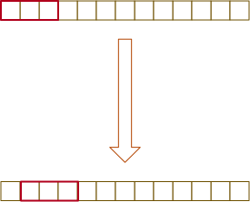

# 28. 实现 strStr() 函数
给定一个 haystack 字符串和一个 needle 字符串，在 haystack 字符串中找出 needle 字符串出现的第一个位置 (从0开始)。如果不存在，则返回  -1。  

示例 1：
```
输入: haystack = "hello", needle = "ll"
输出: 2
```

示例 2：
```
输入: haystack = "aaaaa", needle = "bba"
输出: -1

```

```go
func strStr(haystack string, needle string) int {
}
```

## 解题思路
双指针，从i ～ len 判断是否相等



## 题解

```go
func strStr(haystack string, needle string) int {
    
    if len(haystack) == 0 && len(needle) == 0 {
        return 0
    }
    
    n := len(needle)
    for i:= 0; i + n <= len(haystack); i++ {
        if haystack[i:i+n] == needle {
            return i
        }
    }
    
    return -1
}
```
